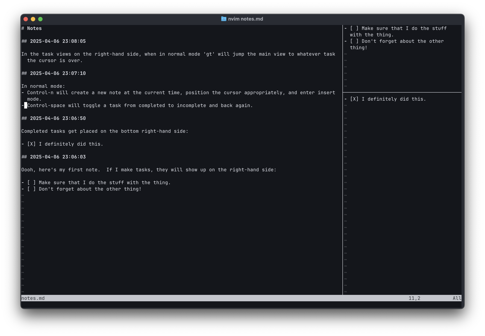

# MarkdownTasks.nvim



A little neovim plugin for note taking and task tracking that I wrote with the
help of Claude.

## Installation

Plop it into your neovim's `config/lua/` folder, and then source it with the
following in your `init.lua` file:

```lua
require('MarkdownTasks').setup({
  width = 40,
  top_height = 10,
  update_interval = 1000,
})
```

If you want, you can also enable git integration which every time you hit
control-n it will automatically submit the file to a git repository.

```lua
require('MarkdownTasks').setup({
  width = 40,
  top_height = 10,
  update_interval = 1000,
  git_integration = true  -- Enable automatic git commits
})
```

## Usage

When you load a markdown file, first execute:

```
:MarkdownTasksOpen
```

You should see two splits open on the right.  The top one is the incomplete
tasks, and the bottom one is the completed ones.

In either the main view or the task views on the right, control-space will
toggle a task between complete and incomplete.

In the task views, `gt` will jump the main view to whatever task the cursor was
in in the task view.

In the main view, control-n will make a new note at the top of file with the
current date and time.  If `git_integration` is enabled, it will submit the
current file to the current git repository before adding the new note at the
top.
